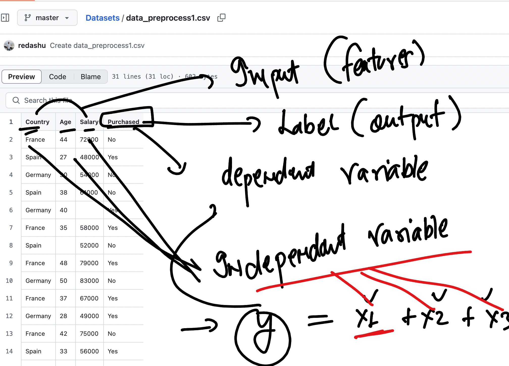
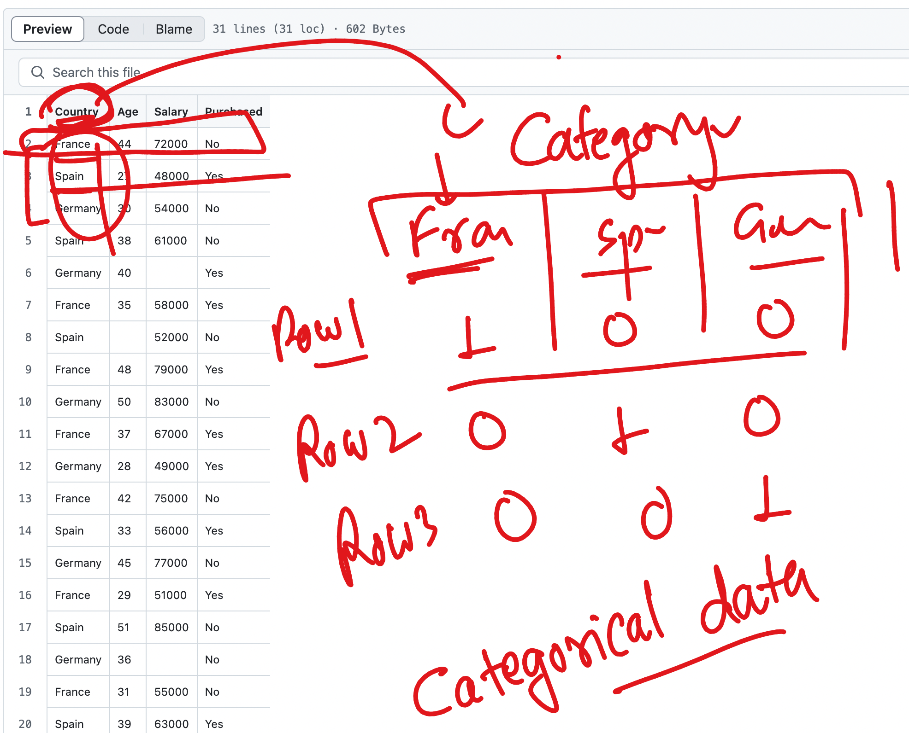
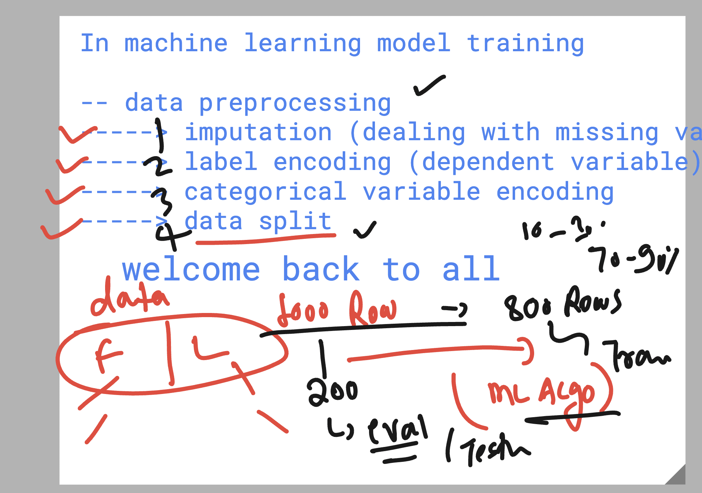
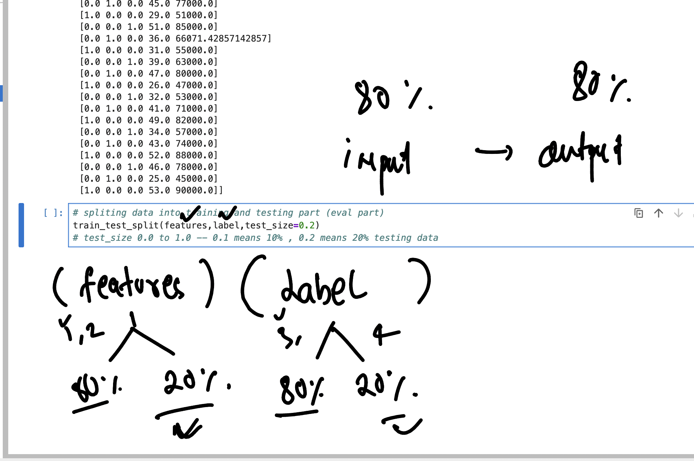
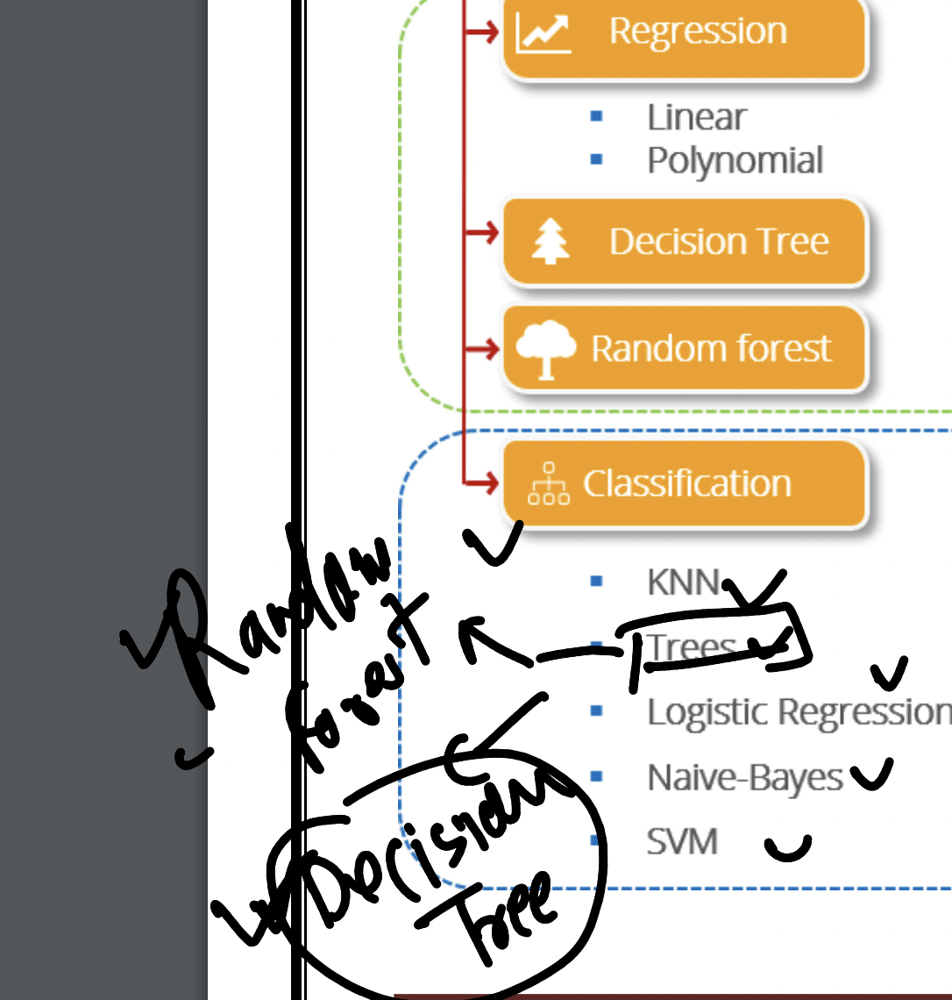

## Understanding Human learning process 


## Data for machine to be trained is having 3 category 


## A simple machine learning process 


## machine learning model training category 


## Supervised Machine learning method  


### Supervised machine learning category


### some machine learning algo's 


## language options to Train machine learning model 


### Login into remote linux ubuntu server from local PC using ssh 

```
PS C:\Users\hp> ssh   learntechbyme@34.9.126.201
The authenticity of host '34.9.126.201 (34.9.126.201)' can't be established.
ED25519 key fingerprint is SHA256:9USn94dPVXUO/7lfwaGevhgjH5oaTLv3/RTyIDEvdKc.
This key is not known by any other names.
Are you sure you want to continue connecting (yes/no/[fingerprint])? yes
Warning: Permanently added '34.9.126.201' (ED25519) to the list of known hosts.
learntechbyme@34.9.126.201's password:
Welcome to Ubuntu 20.04.6 LTS (GNU/Linux 5.15.0-1078-gcp x86_64)

```

### after login to remote server 

- creating python virtual env to install and setup custom python libs 

```
learntechbyme@usgs-ml2:~$ python3  -m venv  ashu-env 
learntechbyme@usgs-ml2:~$ ls
ashu-env  jupyterhub.sqlite  jupyterhub_config.py  jupyterhub_config.py.back  jupyterhub_cookie_secret  usgs
learntechbyme@usgs-ml2:~$ 


```

### loading virtual env 

```
learntechbyme@usgs-ml2:~$ source ashu-env/bin/activate
(ashu-env) learntechbyme@usgs-ml2:~$ 


===>> Installing pandas 

(ashu-env) learntechbyme@usgs-ml2:~$ pip3  install pandas 
Collecting pandas
  Using cached pandas-2.0.3-cp38-cp38-manylinux_2_17_x86_64.manylinux2014_x86_64.whl (12.4 MB)
Collecting pytz>=2020.1
  Using cached pytz-2025.2-py2.py3-none-any.whl (509 kB)
Collecting numpy>=1.20.3; python_version < "3.10"
  Using cached numpy-1.24.4-cp38-cp38-manylinux_2_17_x86_64.manylinux2014_x86_64.whl (17.3 MB)
Collecting tzdata>=2022.1
  Using cached tzdata-2025.2-py2.py3-none-any.whl (347 kB)
Collecting python-dateutil>=2.8.2
  Using cached python_dateutil-2.9.0.post0-py2.py3-none-any.whl (229 kB)
Collecting six>=1.5
  Using cached six-1.17.0-py2.py3-none-any.whl (11 kB)
Installing collected packages: pytz, numpy, tzdata, six, python-dateutil, pandas


```

## IN machine learning supervised Model training 

- data preprocessing is the key thing to be taken care 
- which is before we provide data to any ML algo 


### Info about machine learning model data 

- supervised machine learning data info 


## Dealing with missing values thing in python Machine learning 

- using scikit-learn 

```
ashu-env) learntechbyme@usgs-ml2:~$ pip3 install scikit-learn 
Collecting scikit-learn
  Downloading scikit_learn-1.3.2-cp38-cp38-manylinux_2_17_x86_64.manylinux2014_x86_64.whl (11.1 MB)
     |████████████████████████████████| 11.1 MB 2.9 MB/s 
Requirement already satisfied: numpy<2.0,>=1.17.3 in ./ashu-env/lib/python3.8/site-packages (from scikit-learn) (1.24.4)
Collecting threadpoolctl>=2.0.0

```

## data processing 

- label encoding 


## data processing 

- categorical data handling 


### final data preprocessing 



### Understanding train_test_split function 



### For classification purpose we are going to use DecisionTreeClassifier 


