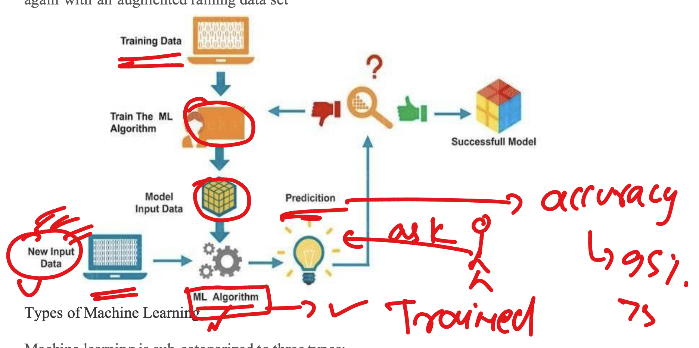
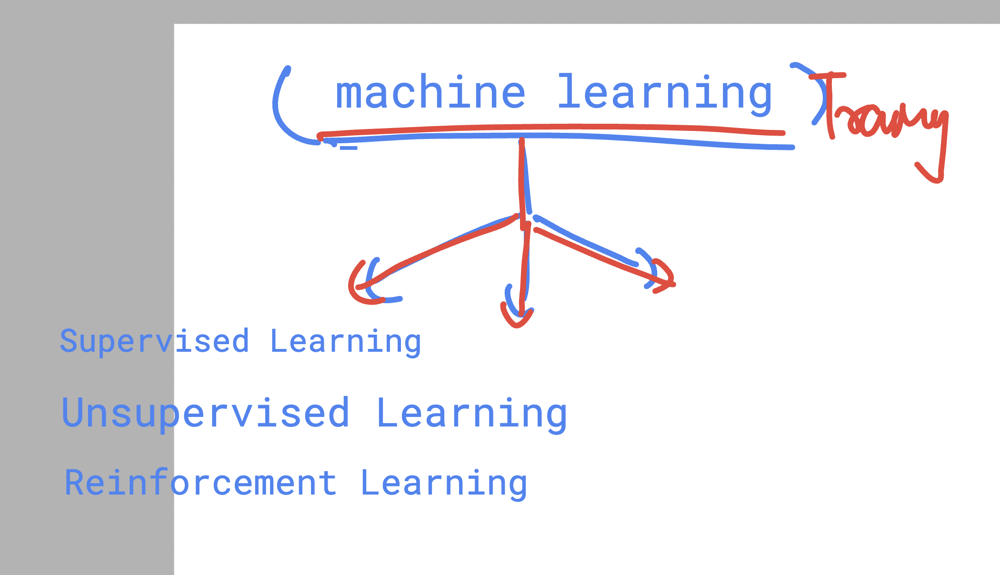
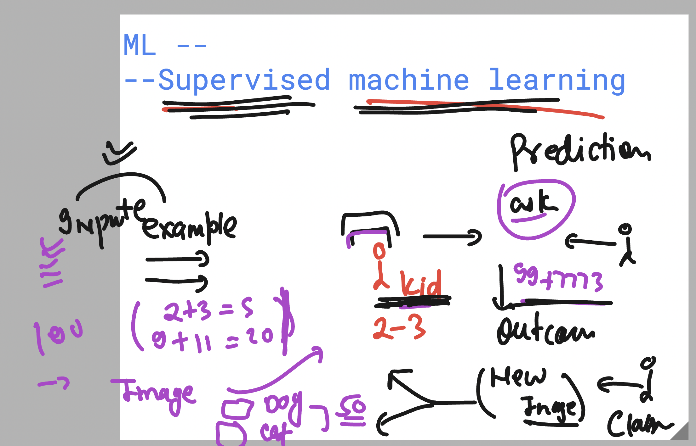
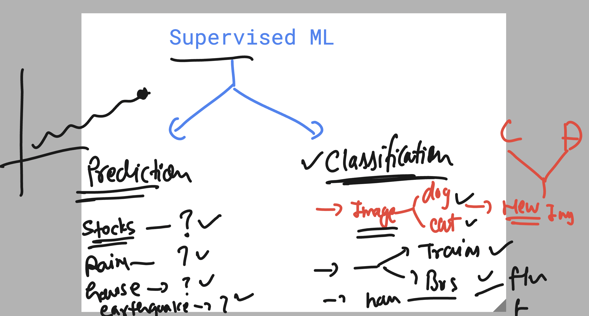
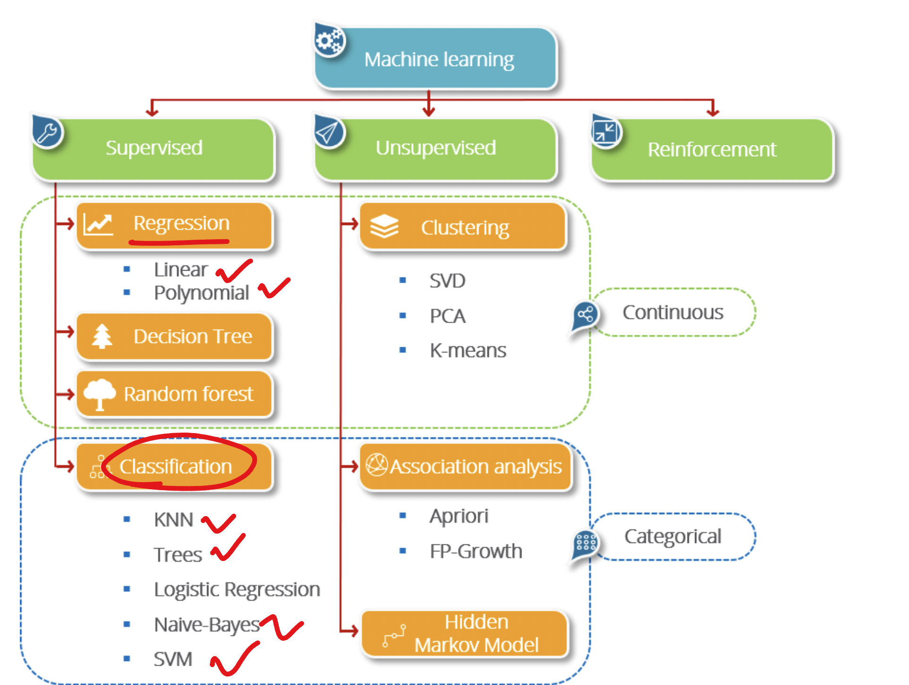

## Understanding Human learning process 


## Data for machine to be trained is having 3 category 


## A simple machine learning process 



## machine learning model training category 



## Supervised Machine learning method  



### Supervised machine learning category



### some machine learning algo's 



## language options to Train machine learning model 


### Login into remote linux ubuntu server from local PC using ssh 

```
PS C:\Users\hp> ssh   learntechbyme@34.9.126.201
The authenticity of host '34.9.126.201 (34.9.126.201)' can't be established.
ED25519 key fingerprint is SHA256:9USn94dPVXUO/7lfwaGevhgjH5oaTLv3/RTyIDEvdKc.
This key is not known by any other names.
Are you sure you want to continue connecting (yes/no/[fingerprint])? yes
Warning: Permanently added '34.9.126.201' (ED25519) to the list of known hosts.
learntechbyme@34.9.126.201's password:
Welcome to Ubuntu 20.04.6 LTS (GNU/Linux 5.15.0-1078-gcp x86_64)

```
