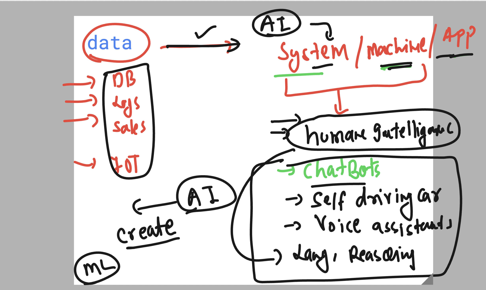
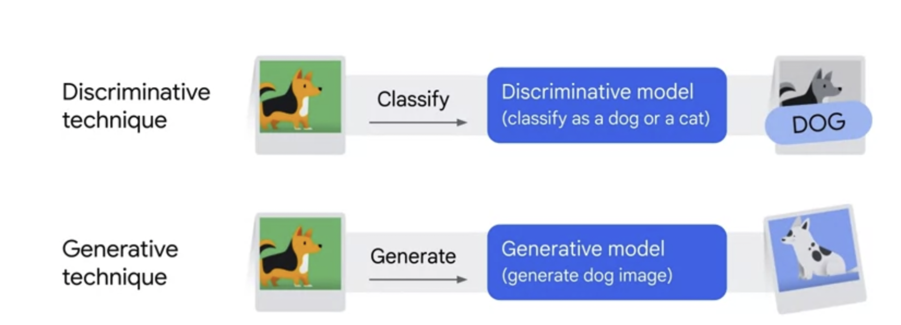
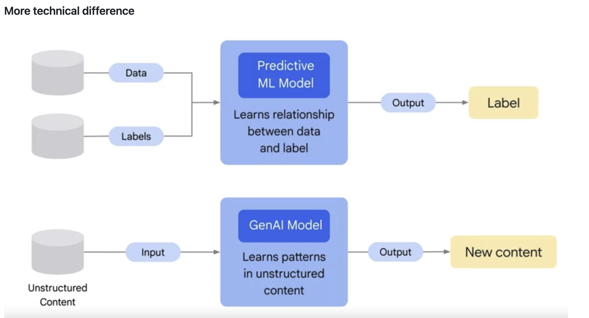
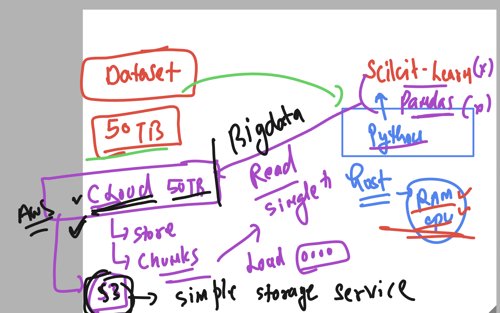
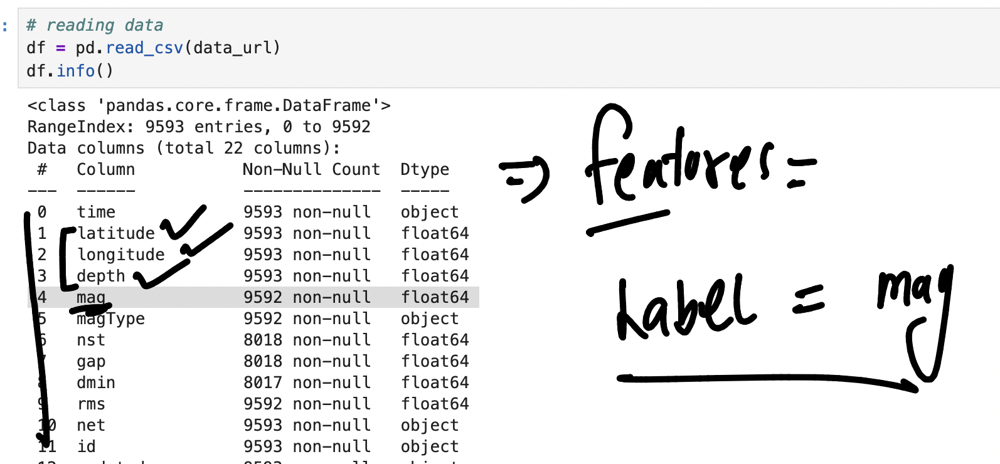
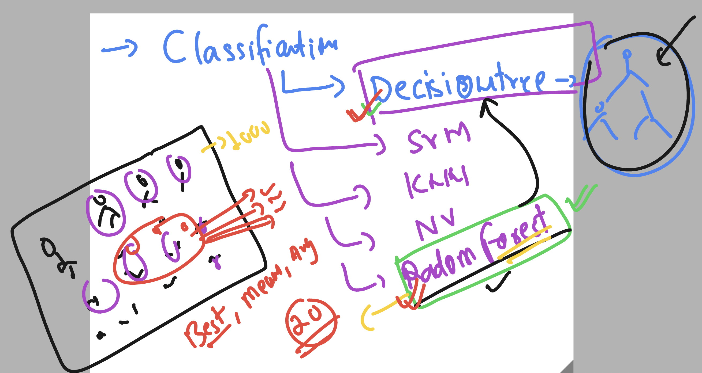

# Understanding AI 



### Understanding ML 


### loading to custom Venv in python 

```
learntechbyme@usgs-ml2:~$ ls
'Untitled Folder'   bean-env        colleen-env   jenny-env              jupyterhub.sqlite           lallen-env   pepin-env     zev-env
 akahler-env        bgressler-env   cory-env      jp-env                 jupyterhub_config.py        lgar-env     ryanc-env
 aritchie-env       bmccarthy_env   cpenn-env     jsk-env                jupyterhub_config.py.back   mark-env     usgs
 ashu-env           clpp-env        eiden-env     jupyterhub-proxy.pid   jupyterhub_cookie_secret    ml-env       zellman-env
learntechbyme@usgs-ml2:~$ 
learntechbyme@usgs-ml2:~$ 
learntechbyme@usgs-ml2:~$ source ashu-env/bin/activate
(ashu-env) learntechbyme@usgs-ml2:~$ pip3 install numpy pandas matplotlib seaborn scikit-learn 
Requirement already satisfied: numpy in ./ashu-env/lib/python3.8/site-packages (1.24.4)

```

## Overall AI tech 



### GenAI vs Discriminate method 



## Understadning DecisionTree classificiation method 


### dealing with huge dataset problem in ML 



## Doing Machine learning data training with earthquake data using Regression tech 

- to predict earthquake mag 



## DecisionTree to RandomForest 



### doing model eval in Classification vs Regression 

