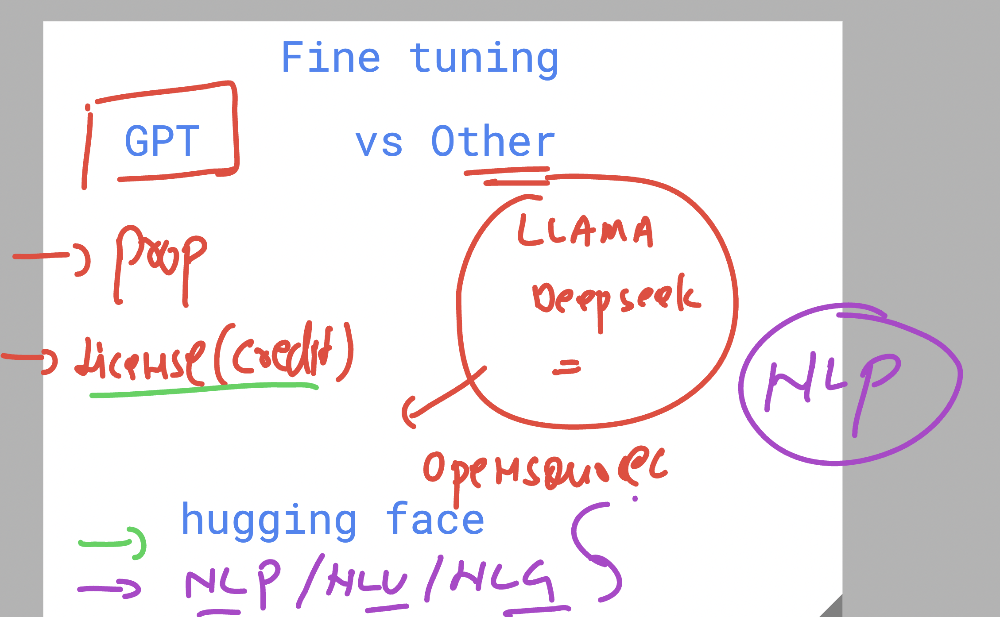

# Starting day 3 

## Revision 

## Revision of ANN structure 

## little info about GenAI and ANN relation 

### feature scaling in data preprocessing 

## Understanding ANN training desing 

## Introducing GenAI 
- category output of DL 
- based ANN 
- trained limited labeled and unlimited unlabeled 
- A specific type of ANN that is Transformers NN 
- massive data set , ebooks , image , videos , docs , sample datasets 

### Generative AI 

## LLM--> Foundation model 

### Example of Foundation Model 

## Info about NLP you can read

## Foundatiaonal model with NLP | NLG | NLU support 

