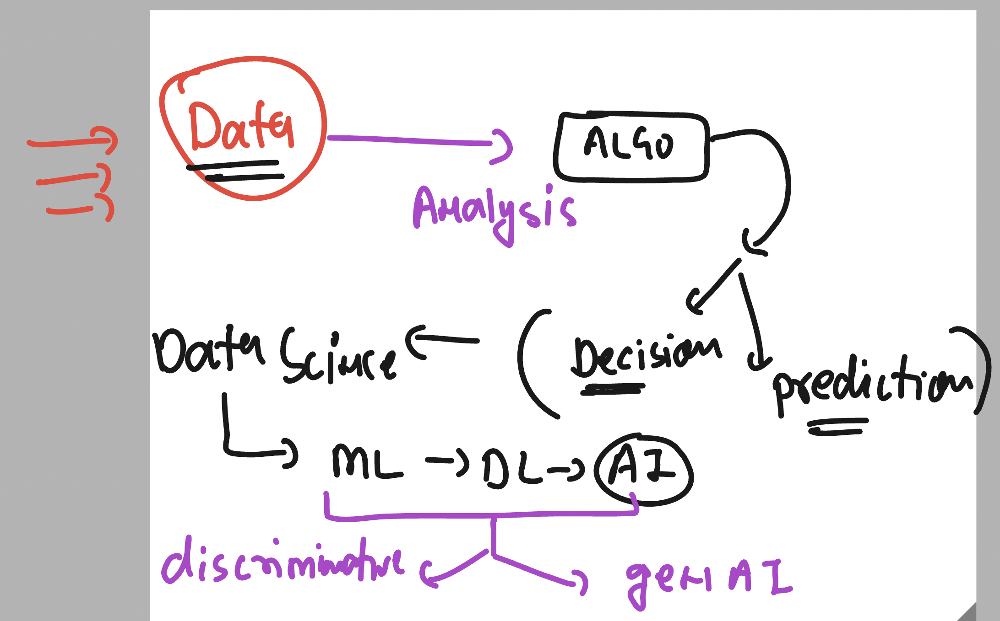
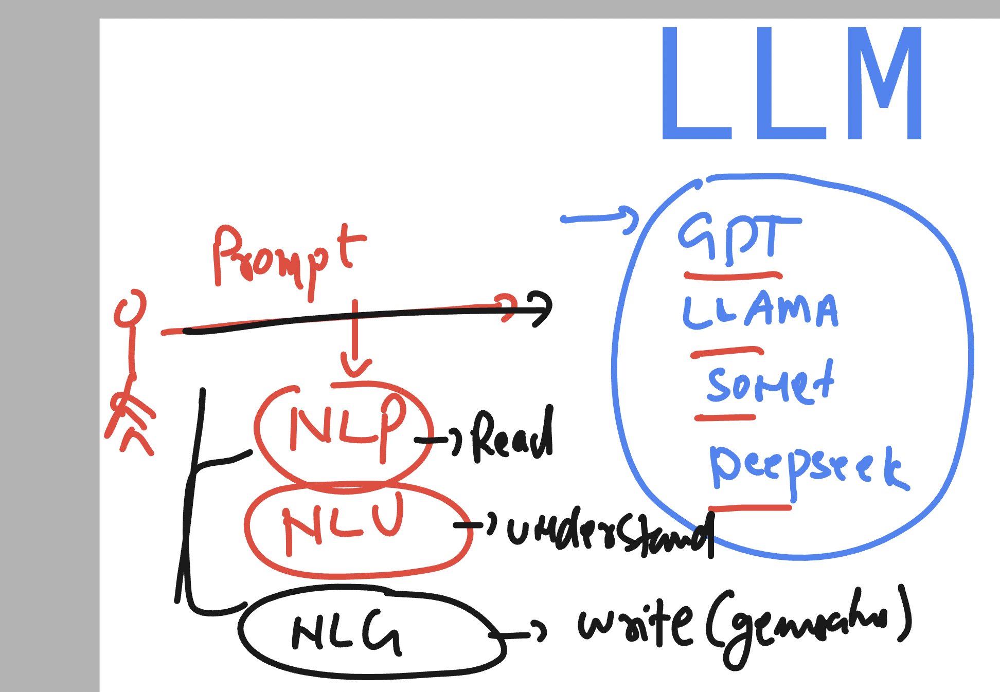
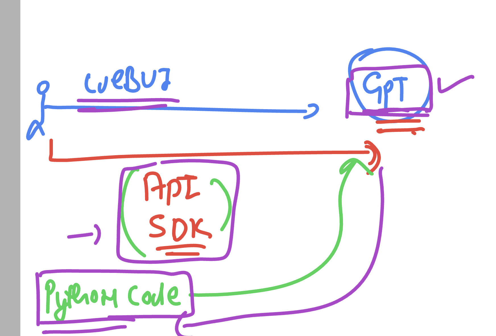
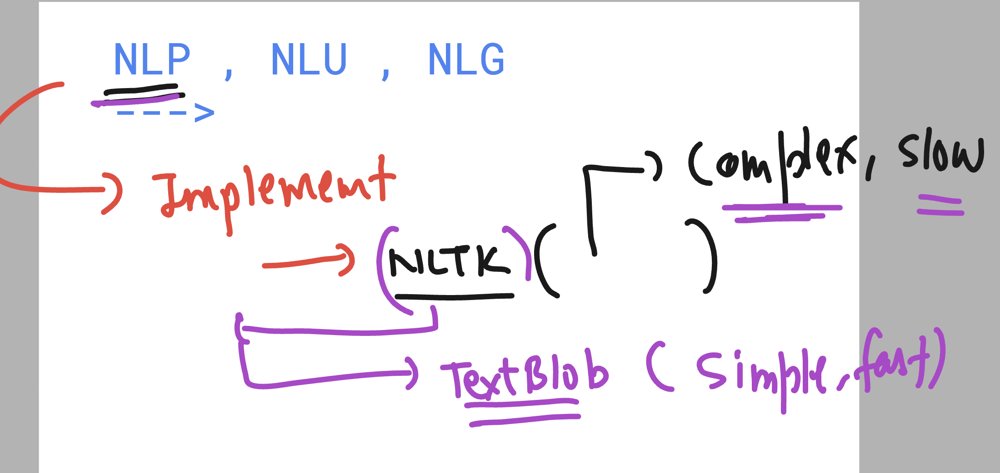
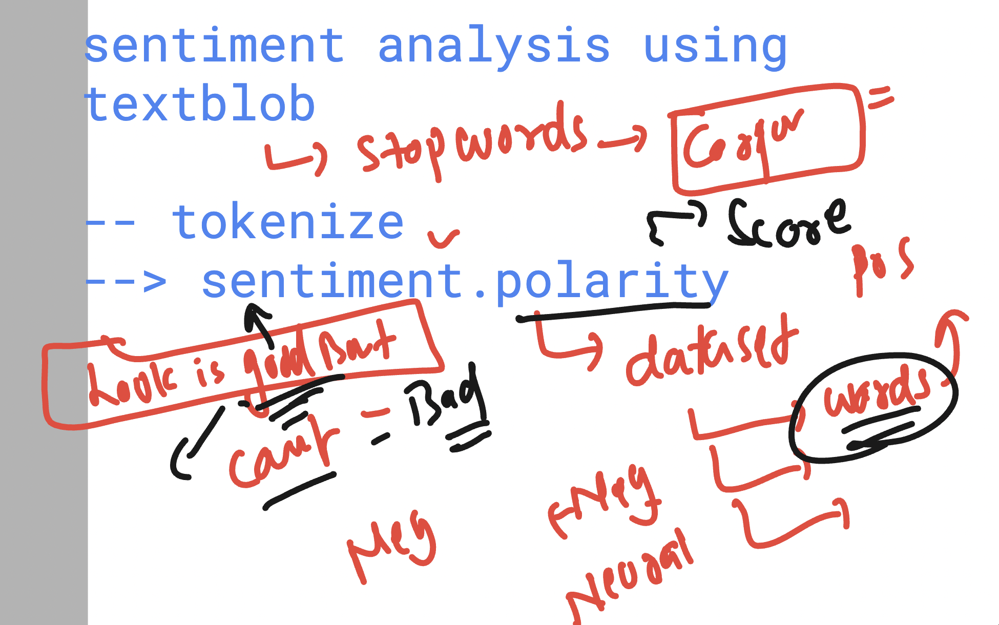
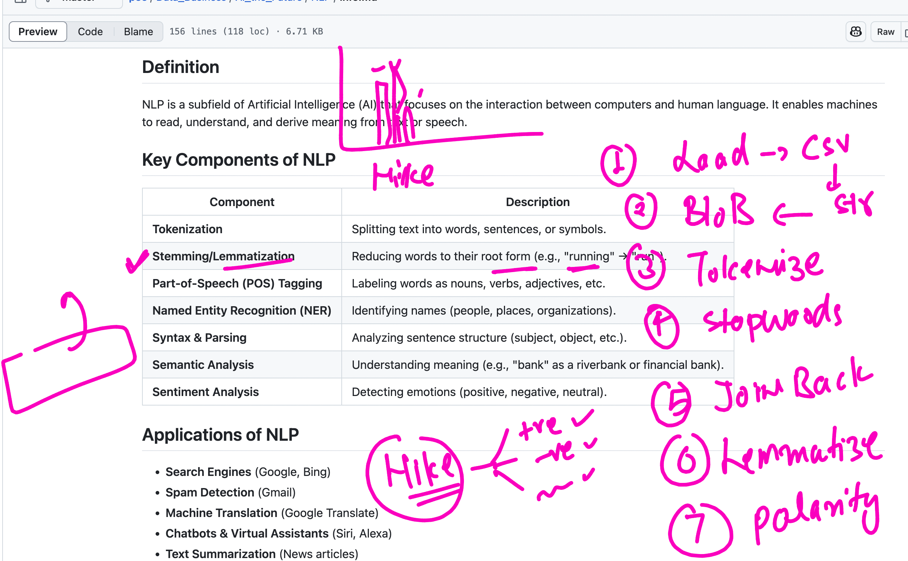

# revision 



## GEN AI 

- DL 
- ANN 
- NLP 
- LLM , FOundation model 

## Usage of NLP  in COnversation process of LLM



## Interaction with GPT model 




### checking openai module status 

```
usgs) learntechbyme@usgsml4:~$ pip list   | grep openai
openai                    1.76.0
(usgs) learntechbyme@usgsml4:~$ pip show openai
Name: openai
Version: 1.76.0
Summary: The official Python library for the openai API
Home-page: https://github.com/openai/openai-python
Author: 
Author-email: OpenAI <support@openai.com>
License: Apache-2.0
Location: /home/learntechbyme/usgs/lib/python3.12/site-packages
Requires: anyio, distro, httpx, jiter, pydantic, sniffio, tqdm, typing-extensions
Required-by: 
(usgs) learntechbyme@usgsml4:~$ 

```

## more info about NLP -- python options 



## for sentiment analysis text blob option understanding 

- checking dataset for words 
- words are having score 
- over score we measure using polarity 
- Range of polarity (-1  +1)
- Positive : Polarity > 0.1  --likes good , awesome ,etc
- Negative : POlarity < - 0.1 -- like , bad , worst etc
- Neutral : Polarity -0.1 to 0.1 



## Process for sentiment analysis from file dataset



